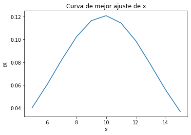
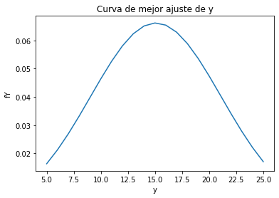
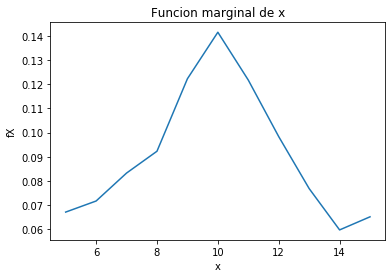
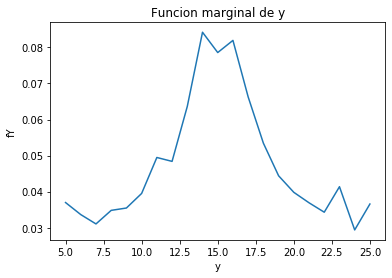
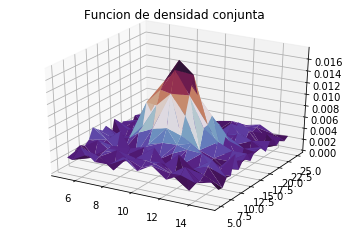

# Tarea 3: Variables Aleatorias Multiples
Modelos Probabilísticos de señales y sistemas.

Thamara Montero Montoya. B64577.

Asignaciones de la tarea 3.

# Curva de ajuste para las funciones de densidad marginales de X y Y.
En las imágenes que se muestran a continuación es posible observar las funciones de densidad marginales tanto de X como de Y. Estas imágenes se obtuvieron gracias a las herramientas para analizar datos de Python.

Dado el comportamiento de ambas curvas observarble en la sección 4.

 

# Expresión de la función de densidad conjunta que modela los datos.

# Valores de correlación, covarianza y coeficiente de correlación (Pearson) para los datos y su significado.

# Funciones de densidad marginales (2D), la función de densidad conjunta (3D).
## Funciones marginales:
 

## Función de densidad conjunta:

